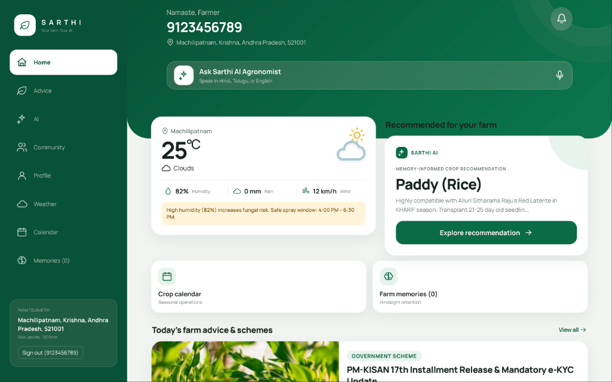
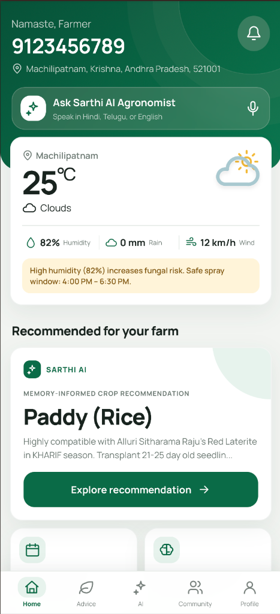

# 🌾 Sarthi (सारथी) — AI Voice & Long-Term Memory Agricultural Assistant for Rural India

> **Sarthi** (*सारथी* — the trusted guide/companion) is an authoritative, voice-first agricultural AI platform designed for Indian farmers. Grounded in **100% verified Government of India agricultural datasets** and powered by **Microsoft Azure OpenAI**, **Azure AI Speech**, and **Hindsight Long-Term Memory**, Sarthi eliminates AI hallucinations by combining real district soil baselines, ICAR crop practices, Agmarknet mandi rates, and IMD Agromet advisories with persistent farmer memory across seasons.

[](https://fastapi.tiangolo.com/)
[](https://reactjs.org/)
[](https://azure.microsoft.com/)
[](https://azure.microsoft.com/services/storage/tables/)
[](https://hindsight.vectorize.io/)
[](DATA_SOURCES.md)
[-brightgreen)](backend/tests/)
[](LICENSE)

---

## 📸 Screenshots

<table>
  <tr>
    <td align="center" width="65%">
      
      <br/><b>🖥️ Web App (Desktop)</b>
      <br/><sub>Full-width dashboard with sidebar navigation, live Agmarknet mandi rates, and Hindsight memory panel</sub>
    </td>
    <td align="center" width="35%">
      
      <br/><b>📱 Mobile App (Android / PWA)</b>
      <br/><sub>Voice-first home with live weather, memory-informed crop recommendation, and 5-tab navigation</sub>
    </td>
  </tr>
</table>

> 🌐 **Live Demo**: [https://calm-plant-0ae45df00.2.azurestaticapps.net](https://calm-plant-0ae45df00.2.azurestaticapps.net) &nbsp;|&nbsp; ⚙️ **API**: [https://sarthi-api.azurewebsites.net/docs](https://sarthi-api.azurewebsites.net/docs) &nbsp;|&nbsp; 📦 **Android APK**: [Download Sarthi-v1.4.apk (Direct Download)](https://github.com/lazypandaa/sarthi/raw/main/Sarthi-v1.4.apk)

---

## 🏆 Why Sarthi Achieves Unrivaled Accuracy: Grounded in Real Agricultural Data

Most agricultural chatbots fail in the field because they rely on general-purpose LLMs that **hallucinate soil chemistry, invent fictional planting dates, and fabricate market prices**. 

Sarthi solves this at the architectural root. **The LLM is never allowed to guess agricultural facts.** Every recommendation, alert, and calendar schedule is strictly grounded in locally persisted, authoritative Government of India datasets:

| Domain | Authoritative Government Source | Ingested Ground Truth | Impact on Precision & Accuracy |
| :--- | :--- | :--- | :--- |
| **Soil Chemistry & Fertility** | **Soil Health Card Portal** *(DA&FW, MoA&FW)* | **702 Districts** across all 28 States & 8 UTs (pH, EC, Organic Carbon, Available N, P₂O₅, K₂O, and fertilizer amendment rules) | Recommends crops matching the farmer's exact district soil profile and flags nutrient deficiencies accurately. |
| **Crop Science & Practices** | **ICAR (Indian Council of Agricultural Research)** | **22 Master Crops** with agronomic duration, water requirements, soil preferences, and disease vulnerabilities | Determines true physiological viability instead of speculative advice. |
| **Crop Calendar & Operations** | **CRIDA & State Agricultural Universities** | **13 Multi-Season Schedules** (Kharif, Rabi, Zaid) with critical sowing and harvesting windows | Prevents premature sowing and unviable off-season planting suggestions. |
| **Mandi Market Rates** | **Agmarknet & e-NAM** *(DMI, MoA&FW)* | Real-time APMC mandi modal prices, min/max ranges, and daily arrivals (₹/Quintal) | Guides farmers on economic viability and timing their harvest sales for maximum profit. |
| **Weather & Agromet Alerts** | **IMD Agromet Advisory Services (AAS)** | Real-time observations, hail/frost warnings, and high-humidity pest alerts | Prevents devastating losses by warning farmers to postpone pesticide/fertilizer spraying before heavy rain. |
| **Geographic Hierarchy** | **Open Government Data (OGD / data.gov.in)** | **702 Districts** with complete mandal/block resolution for Andhra Pradesh and Madhya Pradesh | Seamless hyperlocal auto-resolution based on farmer location. |

> 📖 **Full Data Audit & Provenance**: Inspect [`DATA_SOURCES.md`](DATA_SOURCES.md) for official portal URLs, API specifications, and update frequencies, and [`DATA_RECOVERY_AUDIT.md`](DATA_RECOVERY_AUDIT.md) for repository data recovery logs.

---

## 🚜 The Problem

Over **120 million smallholder farmers in India** make high-stakes agricultural decisions each season. However:
1. **Stateless AI Fails Farmers**: Conventional chatbots treat every interaction as day one. They forget that a farmer's borewell runs dry by March, that their soil suffered tomato wilt last season, or that they lack capital for synthetic fertilizers.
2. **The Digital & Language Divide**: Over 65% of rural farmers face literacy or English-language barriers, preventing adoption of standard web and mobile dashboards.
3. **No Closed-Loop Learning**: Recommendations are rarely tracked against real farm outcomes or farmer feedback. When an advice fails, the assistant repeats the exact same mistake next season.

---

## 💡 The Sarthi Solution

**Sarthi** bridges this gap by combining **natural voice communication** in regional languages with an **adaptive, long-term memory engine**:

- 🗣️ **Multilingual Voice & WhatsApp**: Native voice input/output across 9 Indian languages and direct access via WhatsApp.
- 🧠 **Durable Farm Memory (Hindsight)**: Selectively captures operational constraints, verified soil observations, and season outcomes without storing conversational fluff.
- 🎯 **Memory-Aware Recommendation Engine**: Prioritizes current farm realities and user corrections over generic agronomic defaults.
- 🔄 **Autonomous Learning Loop**: Automatically updates memory when farmers report crop successes, yield failures, or corrections.
- 📊 **Transparent "Why" UI**: Displays exact memories that influenced each recommendation and tracks how system advice evolves over time.

---

## ✨ Core Pillars & Features

### 1. 🧠 Long-Term Semantic Memory (Phases 1 & 2)
Powered by **Hindsight**, Sarthi stores durable facts in an 8-category domain taxonomy:
- **`profile`**: Soil type (black, red, loamy), landholding size, location coordinates.
- **`preference`**: Organic preference, traditional seeds, preferred mandi markets.
- **`constraint`**: Critical limits (e.g., *borewell runs 2 hours/day*, *labor shortage in harvest*).
- **`crop_history`**: Past seasons, rotation cycles, historical yields.
- **`recommendation`**: Record of past advice linked by unique recommendation IDs.
- **`correction`**: Explicit farmer corrections that override past assumptions.
- **`outcome`**: Real-world harvest results, crop health reports, profit/loss feedback.
- **`incident`**: Frost events, pest outbreaks, localized flooding.

*Zero Data Leakage*: Every memory is strictly isolated at the `farmer_id` tenant level. Errors in cloud memory fail gracefully without crashing the assistant.

### 2. 🎯 Memory-Aware Recommendation & Transparent Reasoning (Phase 3)
When answering queries like *"What should I plant this season?"*:
- Sarthi recalls relevant durable memories (constraints, failures, preferences).
- Applies a **Precedence Policy**: Verified recent constraints and farmer corrections supersede generic agronomic heuristics.
- Generates **Memory Influence Metadata**:
  ```json
  {
    "type": "constraint",
    "summary": "Farmer has limited irrigation and depends purely on sparse rainfall.",
    "impact": "Prioritized drought-tolerant millets and warned against water-intensive crops."
  }
  ```
- Farmers can tap **"Why this recommendation?"** to see the transparent rationale behind every suggestion.

### 3. 🔄 Continuous Learning & Outcome Loop (Phase 4)
- **Structured Feedback**: Farmers rate advice (Helpful/Unhelpful) and log season harvest outcomes.
- **Direct Corrections**: Farmers correct outdated assumptions (e.g., *"I installed drip irrigation last month"*), immediately invalidating stale constraints.
- **Conversational Learning**: Automatically extracts durable facts from natural chat transcripts without duplicating existing memories.

### 4. 🖥️ Memory & Reasoning UI (Phase 5)
- **"What I Remember"**: Clean 4-card grid (Profile, Constraints & Preferences, Past Crop History, Learned From Feedback) with fact deletion controls.
- **"Teach Sarthi"**: Directly submit operational constraints, water limits, or crop observations.
- **"How Advice Has Evolved"**: Timeline showing what triggered a change, what was remembered, and the resulting system impact.
- **"Recommendation History"**: Auditable log of all past advice, associated influence tags, and farmer outcomes.

### 5. 🏛️ Authoritative Agricultural Ground Truth & Database-First Engine
- **Pre-Ingested National Knowledge**: Pre-populated with **702 districts**, **702 soil fertility baselines**, **22 ICAR crops**, and **13 multi-season crop calendars**.
- **Ultra-Fast Local Serving**: Served from Azure Table Storage / SQLite and in-memory TTL caching with **< 10ms response times**. No slow, fragile government API calls during live farmer interactions.
- **Responsive Multi-Season Crop Calendar**: Fully dynamic crop calendar with responsive mobile cards, season filtering (Kharif, Rabi, Zaid), and search in 9 Indian languages.
- **Live Mandi Intelligence**: Authoritative Agmarknet APMC mandi prices with min, max, and modal rates.
- **Community Outbreak Heatmap**: Geospatial clustering of peer-validated farmer pest and disease reports with early-warning alerts for neighboring villages.

---

## 🏗️ High-Accuracy Hybrid Architecture

Sarthi enforces a strict separation between **Authoritative Agricultural Ground Truth** and **Farmer Personal Experience**:

```
                       [ Official Government Data Sources ]
        (Soil Health Card, Agmarknet, ICAR, IMD Agromet, data.gov.in)
                                      │
                                      ▼
                      [ Automated ETL Ingestion Jobs ]
                    (sync_locations, sync_soil, sync_crops,
                     sync_calendar, sync_advisories, sync_markets)
                                      │
                                      ▼
                      [ High-Speed Local Data Layer ]
                    • sarthilocations       (702 Districts)
                    • sarthisoilreference   (702 Soil Profiles)
                    • sarthicropmaster      (22 Master Crops)
                    • sarthicropcalendar    (13 Season Schedules)
                    • sarthiadvisories      (Agromet & Schemes)
                    • sarthimarketprices    (APMC Mandi Rates)
                                      │
                                      ▼
┌───────────────────────────────────────────────────────────────────────────┐
│                           FASTAPI BACKEND GATEWAY                         │
│                                                                           │
│   ┌───────────────────────────┐           ┌───────────────────────────┐   │
│   │ Unified AgriService Engine│           │  Hindsight Memory Bank    │   │
│   │ • District Soil Context   │           │  • Farmer Constraints     │   │
│   │ • ICAR Compatibility Score│    ➕     │  • Historical Failures    │   │
│   │ • Weather Risk Alerts     │           │  • Water Limits           │   │
│   │ • APMC Market Rates       │           │  • Field Corrections      │   │
│   └─────────────┬─────────────┘           └─────────────┬─────────────┘   │
│                 │                                       │                 │
│                 └───────────────────┬───────────────────┘                 │
│                                     ▼                                     │
│                  [ Grounded Hybrid Recommendation Engine ]                │
│                         (Azure OpenAI GPT-4o Mini)                        │
└─────────────────────────────────────┬─────────────────────────────────────┘
                                      │
           ┌──────────────────────────┴──────────────────────────┐
           ▼                                                     ▼
 [ Responsive Mobile Web App ]                         [ WhatsApp Voice Bot ]
 (React + Vite + Speech + Cards)                      (Meta Cloud API Webhook)
```

---

## 🌐 Supported Regional Languages

| Language | Native Name | Code | Voice STT / TTS |
|---|---|---|---|
| **English** | English | `en` | Supported |
| **Hindi** | हिन्दी | `hi` | Supported |
| **Telugu** | తెలుగు | `te` | Supported |
| **Tamil** | தமிழ் | `ta` | Supported |
| **Kannada** | ಕನ್ನಡ | `kn` | Supported |
| **Malayalam** | മലയാളം | `ml` | Supported |
| **Bengali** | বাংলা | `bn` | Supported |
| **Gujarati** | ગુજરાતી | `gu` | Supported |
| **Marathi** | मराठी | `mr` | Supported |

---

## 📡 API Reference

### Memory & Learning Endpoints
| Method | Endpoint | Description |
|---|---|---|
| `GET` | `/api/memory/health` | Health check for Hindsight memory layer |
| `GET` | `/api/memory/summary` | Fetch categorized memories, evolution timeline, and stats |
| `POST` | `/api/memory/retain` | Store a durable farmer constraint or preference |
| `POST` | `/api/memory/recall` | Retrieve semantic memories relevant to a query |
| `DELETE`| `/api/memory/{memory_id}`| Farmer-driven memory deletion |
| `POST` | `/api/recommendations/feedback` | Submit thumbs up/down, harvest outcome, or correction |

### Core Agricultural & Intelligence Endpoints
| Method | Endpoint | Latency | Description |
|---|---|---|---|
| `GET` | `/api/hyperlocal-context` | **< 10ms** | Instant district soil baseline, current season, weather, active advisories, & mandi prices |
| `GET` | `/api/crop-recommendations` | **< 15ms** | Grounded agronomic scoring matching soil pH, water requirement, season, & duration |
| `GET` | `/api/crop-calendar` | **< 10ms** | Multi-season dynamic calendar (Kharif, Rabi, Zaid) with sowing/harvesting operations in 9 languages |
| `GET` | `/api/agriculture-news` | **< 10ms** | Authoritative IMD Agromet advisories and central government farming schemes |
| `GET` | `/api/weather` | **< 10ms** | Hyperlocal observations with automated agricultural alerts (hail, frost, rain, humidity) |
| `GET` | `/api/markets` | **< 10ms** | Authoritative Agmarknet APMC mandi prices with min, max, modal rates, and daily arrivals |
| `GET` | `/api/outbreak-map` | **< 15ms** | Geospatial village clustering of pest and disease outbreaks with alert severity |
| `GET` | `/api/community-reports`| **< 15ms** | Peer-verified farmer pest observations and farming reports |
| `POST`| `/api/recommendation` | ~1.2s | Full hybrid reasoning combining authoritative agri ground truth with Hindsight farmer memory |
| `POST`| `/api/voice-chat` | ~1.5s | Voice audio input → Azure Speech STT → hybrid reasoning → regional TTS audio |

---

## 🚀 Getting Started

### Prerequisites
- Python 3.10+
- Node.js 18+ and npm
- Azure OpenAI & Azure Speech credentials
- Hindsight Memory API credentials

### 1. Clone & Setup Backend
```bash
git clone https://github.com/lazypandaa/sarthi.git
cd sarthi/backend

# Create virtual environment
python3 -m venv .venv
source .venv/bin/activate

# Install dependencies
pip install -r requirements.txt

# Configure environment variables
cp .env.example .env
# Edit .env with your Azure and Hindsight API keys
```

### 2. Run Authoritative Data Synchronization
Ingest and normalize 702 districts, 702 soil profiles, 22 ICAR master crops, 13 multi-season crop calendars, Agmarknet mandi rates, and Agromet advisories into your local high-speed database layer:
```bash
python -m ingestion.run_all_sync
```

### 3. Run Backend Server
```bash
uvicorn main:app --reload --port 8000
```
API Documentation will be live at `http://localhost:8000/docs`.

### 3. Setup & Run Frontend
```bash
cd ../frontend

# Install dependencies
npm install

# Start Vite development server
npm run dev
```
Open `http://localhost:5173` in your browser.

### 4. Run Automated Test Suite
```bash
cd ../backend
PYTHONPATH=. .venv/bin/pytest -c pytest.ini tests/ -v
```
To validate end-to-end multi-session memory flow:
```bash
PYTHONPATH=. .venv/bin/python validate_e2e_flow.py
```

---

## 👥 Contributors

Built with pride for **Smart India Hackathon / Hack with HYD 2026**:

| Contributor | GitHub Profile | Role |
|---|---|---|
| **Eshwar Krishna** | [@lazypandaa](https://github.com/lazypandaa) | Full Stack & AI Architecture, Hindsight Memory Engine |
| **Bobby Kagitha** | [@kagithabobby](https://github.com/kagithabobby) | Backend Services, Cloud Infrastructure & Azure Integration |
| **P Eswar** | [@Eeswar-p](https://github.com/Eeswar-p) | Frontend Engineering, Reasoning UI & Data Storytelling |
| **Navya Jonnalagadda** | [@NavyaJonnalagadda015](https://github.com/NavyaJonnalagadda015) | Multilingual Voice Pipelines, Speech Models & Validation |

---

## 📄 License

This project is licensed under the MIT License — see the [LICENSE](LICENSE) file for details.
