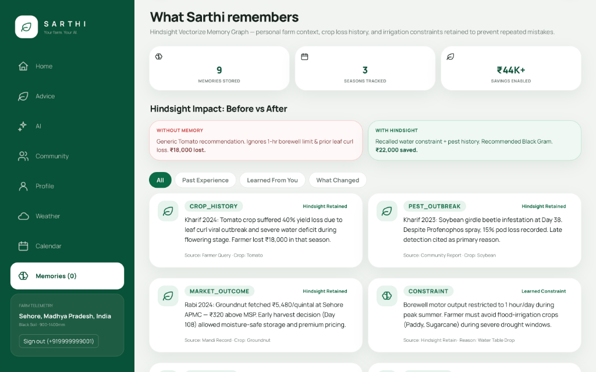
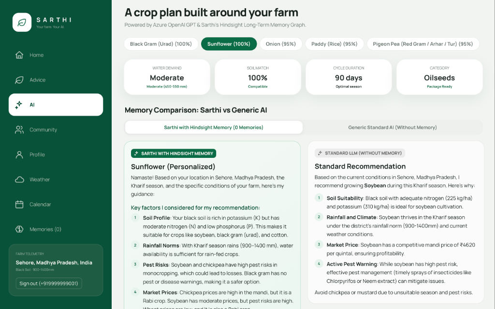

# How I Built a Farming Agent That Remembers with Hindsight

Ask an LLM what to plant in Anantapur, Andhra Pradesh during Kharif season, and it checks red sandy loam soil, monsoon averages, APMC mandi rates, and suggests tomatoes. Agronomically, that advice looks sound.

In practice, if that farmer's borewell runs dry after ninety minutes of pumping each morning, tomatoes mean debt and total crop loss.

When the farmer returns five months later after a failed harvest and asks again—*"What should I grow this season?"*—a stateless chatbot cheerfully suggests tomatoes again. It has no memory of the previous chat, the borewell limit, or the crop failure.

I built [Sarthi](https://github.com/lazypandaa/sarthi) to fix this amnesia by pairing Government of India agronomic baselines with persistent semantic memory powered by [Hindsight](https://github.com/vectorize-io/hindsight). The central technical lesson was clear: storing facts in a vector store is easy; getting recalled memory to reach the reasoning loop and alter the model's decision is where engineering matters.


*Figure 1: Sarthi desktop interface integrating district soil baselines, live mandi prices, and persistent memory indicators.*

---

## When Correct Advice Is Still the Wrong Advice

Most conversational AI assistants operate statelessly, treating returning users as complete strangers. In routine chat interfaces, that amnesia is inconvenient. In agriculture, where decisions span multi-month biological cycles, it is disastrous.

Farming decisions require three historical dimensions that static models lack:
1. **Operational constraints** persisting across seasons (e.g., restricted irrigation, power cuts).
2. **Prior agronomic outcomes** (e.g., past crop failures, pest attacks, realized yields).
3. **Explicit farmer corrections** (e.g., *"I installed drip irrigation last month, so stop assuming I rely solely on rainfall"*).

A conventional RAG pipeline alone does not provide this kind of evolving, tenant-isolated memory. RAG can retrieve reference material, but Sarthi also needs a memory layer that updates from farmer interactions and outcomes.

---

## What Sarthi Actually Remembers

To avoid polluting vector storage with conversational filler, Sarthi rejects storing entire chat transcripts. Instead, the backend enforces an eight-category taxonomy implemented in [`backend/services/hindsight/memory_types.py`](backend/services/hindsight/memory_types.py):

- **`profile`**: Farm attributes (soil type, landholding size, district, language).
- **`preference`**: Farmer inclinations (low-water crops, organic methods).
- **`constraint`**: Hard operational boundaries (borewell yields water one hour daily).
- **`crop_history`**: Historical crops cultivated, seasons, and realized yields.
- **`recommendation`**: Auditable records of previous advice issued by the system.
- **`correction`**: Authoritative farmer statements overriding prior system assumptions.
- **`outcome`**: Realized post-harvest results, economic returns, or failure causes.
- **`incident`**: Unscheduled events (localized frost, pest flare-ups, unseasonal rains).

Each model enforces normalized metadata: source authority (`farmer`, `system`, or `assistant`), ISO timestamp, confidence score, and optional crop/season entities.

---

## Where Hindsight Fits

To handle long-term semantic memory, Sarthi integrates [Hindsight](https://github.com/vectorize-io/hindsight). As outlined in [Vectorize's agent memory overview](https://vectorize.io/what-is-agent-memory), agent memory requires continuous, structured retention beyond static RAG indexes.

The core service lives in [`backend/services/hindsight/`](backend/services/hindsight/), centered on `HindsightClient` and `FarmerMemoryService`.

To avoid tenant bank sprawl, Sarthi maintains a single Hindsight bank (`sarthi`). Tenant isolation is strictly enforced:
1. **Namespace Tagging**: Stored memories carry the tag `farmer:<farmer_id>`.
2. **Scoped Recall**: Recall requests specify `tags=[f"farmer:{farmer_id}"]`.
3. **Client-Side Guard**: `FarmerMemoryService.recall_memories()` validates `metadata["farmer_id"]`, immediately dropping any mismatched item.
4. **JWT Identity Binding**: In [`backend/main.py`](backend/main.py), `farmer_id` is extracted from the authenticated JWT token.

An in-memory SHA-256 deduplication cache tracks recent writes per farmer, skipping identical retention requests locally. Implementation details are documented in the [Hindsight documentation](https://hindsight.vectorize.io/).

---

## The Part That Actually Changed the Recommendation

Storing memory is meaningless if the LLM ignores it during reasoning. In Sarthi, the `MemoryAwareRecommender` coordinates a structured reasoning pipeline.

First, it applies a **Precedence Policy** so recent infrastructure upgrades override stale constraints:

```python
def apply_precedence_policy(self, grouped: Dict[str, List[Dict[str, Any]]], current_query: str):
    """Overrides stale water constraints when new irrigation is reported."""
    if re.search(r"(?:installed|built|added|now\s+have)\s+.*?(?:drip|borewell|irrigation)", current_query.lower()):
        grouped["constraints"] = [
            c for c in grouped["constraints"]
            if "irrigation" not in c["text"].lower() and "water" not in c["text"].lower()
        ]
    return grouped
```

Next, `format_memory_for_prompt()` formats verified memories into an explicit reasoning prompt block for Azure OpenAI GPT-4o-mini:

```python
def format_memory_for_prompt(self, assembled_context: Dict[str, List[Dict[str, Any]]]) -> str:
    sections = []
    if assembled_context.get("constraints"):
        sections.append("Constraints:\n" + "\n".join(f"  - {c['text']}" for c in assembled_context["constraints"]))
    if assembled_context.get("crop_history"):
        sections.append("History:\n" + "\n".join(f"  - {h['text']}" for h in assembled_context["crop_history"]))

    directive = (
        "DIRECTIVE: If a crop conflicts with a remembered constraint or previously failed, "
        "explicitly account for it and suggest realistic alternatives."
    )
    return "=== REMEMBERED FARMER CONTEXT ===\n" + "\n\n".join(sections) + f"\n\n{directive}\n"
```

### The Before / After Impact

Consider a farmer in Anantapur asking: *"What should I grow this season?"*

- **Before Memory**: Without historical context, Sarthi inspects regional red soil and recommends Tomato for high market returns. The farmer plants it, their borewell runs dry, and the crop fails completely.
- **Memory Retention**: In chat, the farmer reports: *"I tried tomato last season and it failed because I didn't have enough water. My borewell only runs for one hour a day."* Sarthi extracts and retains a `ConstraintMemory` (borewell limit) and a `CropHistoryMemory` (tomato failure).
- **After Memory**: Next season, the farmer asks again. Sarthi recalls both memories and generates:
  > *"Avoid Tomato. Your previous crop suffered total loss from water shortage, and your borewell supplies water only one hour daily. Given your soil and water limits, prioritize drought-resilient Pearl Millet (Bajra) or early-maturing Groundnut instead."*

The engine simultaneously outputs structured memory influence metadata:
```json
[
  {"type": "constraint", "summary": "Borewell runs 1 hr daily", "impact": "Prioritized drought-tolerant crops"},
  {"type": "crop_history", "summary": "Tomato failed from water shortage", "impact": "Deprioritized tomato to avoid repeat loss"}
]
```


*Figure 2: Sarthi memory-informed recommendation comparison showing personalized crop guidance versus standard generic LLM output.*

---

## The Recall Bug We Had to Fix

During testing, we encountered an instructive bug with multi-category retrieval.

Our taxonomy defines mutually exclusive types. Initially, our recall query passed multiple type tags to Hindsight:

```python
    # The buggy approach
    tags = [f"farmer:{farmer_id}", "type:constraint", "type:crop_history"]
    results = client.recall(bank_id="sarthi", query=query, tags=tags, tags_match="all")
```

Because `tags_match="all"` requires returned items to match *every* tag, and no document shares both tags, Hindsight returned an empty list (`[]`), blinding the assistant to stored memories. Switching to `tags_match="any"` was unsafe: without strict farmer isolation, it risked pulling another farmer's constraints.

### The Isolation-Safe Fix

We resolved this by scoping Hindsight retrieval strictly to the farmer tag and performing taxonomy filtering in application code:

```python
    # Verified fix in FarmerMemoryService.recall_memories()
    raw_results = self.client.recall(
    bank_id=self.config.bank_id,
    query=query.strip(),
    tags=[f"farmer:{validated_farmer_id}"],
    limit=max(limit * 3, 25),
    tags_match="any",
)

isolated_results = []
for item in raw_results:
    item_meta = item.get("metadata") or {}
    if item_meta.get("farmer_id") != validated_farmer_id:
        continue  # Drop cross-tenant leaks
    mem_type = item_meta.get("memory_type", "profile").lower()
    if allowed_types and mem_type not in allowed_types:
        continue
    isolated_results.append(item)
    if len(isolated_results) >= limit:
        break
```

This decoupled vector search from multi-label business logic while guaranteeing tenant privacy.

---

## Making Memory Visible

Agent memory must be transparent. If an assistant retains inaccurate facts, farmers need clear inspection and correction tools.

In Sarthi's frontend, the Memory tab renders state from `GET /api/memory/summary`:
- **Four-Card Grid**: Organizes knowledge into Farm Profile, Working Preferences, Past Experience, and Learned From You.
- **Evolution Timeline**: Displays *"How Advice Has Evolved"*, showing what triggered a change (e.g., water shortage report) and the resulting advisory adjustment.
- **Direct Correction**: Farmers use *"Teach Sarthi"* to manually update soil attributes or operational limits via `POST /api/memory/retain`.


*Figure 3: Sarthi Memory Dashboard displaying stored operational constraints, pest outbreaks, past crop experience, and before vs. after impact.*

---

## What I Learned

1. **Async Boundaries in Hybrid Runtimes**: Inside FastAPI async route handlers, calling sync SDK methods directly can cause event-loop deadlocks. Offloading SDK executions to an isolated thread-pool worker (`_run_coro`) resolved runtime collisions.
2. **Selective Gating Conserves Resources**: Invoking vector recall on casual greetings (*"namaste"*, *"good morning"*) wastes tokens. Adding `is_memory_relevant_query()` to gate retrieval on decision keywords eliminated unnecessary cloud queries.
3. **Precedence Prevents Stale Bias**: Agents cannot accumulate constraints monotonically. Without explicit precedence rules, obsolete constraints contradict new field realities.
4. **Closed-Loop Feedback Completes Learning**: Connecting `POST /api/feedback` to structured outcomes (`success`, `failure`, `partial`) allowed post-harvest realities to become future decision context.

---

## What This Changes About Agent Memory

The true test of an agent memory system is not how many embeddings it writes to an index. It is whether recalled facts reliably redirect the model away from recommendations that would otherwise fail in the field.

By combining current agricultural context with persistent farmer-specific memory, Sarthi gives the recommendation workflow access to information that would otherwise disappear between sessions.

The complete implementation and documentation are available on the [Sarthi GitHub repository](https://github.com/lazypandaa/sarthi).

> **Publishing note:** Tag the official Code.in account when publishing this article, as required by the submission guide.
